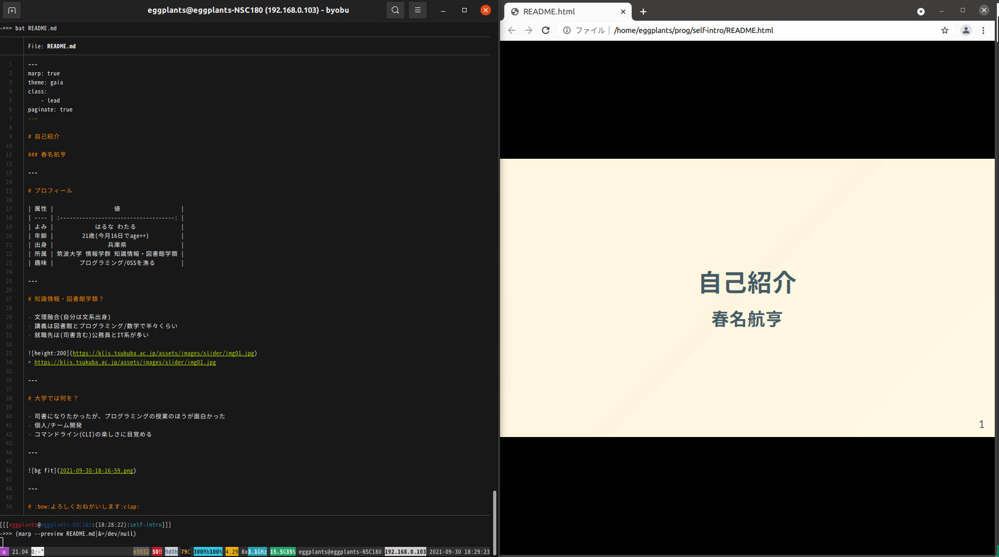

# 自己紹介

### 2022年新卒 春名航亨

---

# プロフィール

| 属性                                      |                     値                     |
| ----------------------------------------- | :----------------------------------------: |
| よみ                                      |               はるな わたる                |
| 年齢                                      |           21歳(今月16日でage++)            |
| 出身                                      |                   兵庫県                   |
| 所属                                      |   筑波大学 情報学群 知識情報・図書館学類   |
| 趣味                                      |          プログラミング/OSSを漁る          |
|  | [@eggplants](https://github.com/eggplants) |

---

# 知識情報・図書館学類？

- 文理融合(自分は文系出身)
- 講義は図書館とプログラミング/数学で半々くらい
- 就職先は(司書含む)公務員とIT系が多い

> https://klis.tsukuba.ac.jp/assets/images/slider/img01.jpg

---

# 大学では何を？

- 司書になりたかったが、プログラミングの授業のほうが面白かった
- 個人/チーム開発
- コマンドライン(CLI)の楽しさに目覚める

---

# :bow:よろしくおねがいします:clap:
